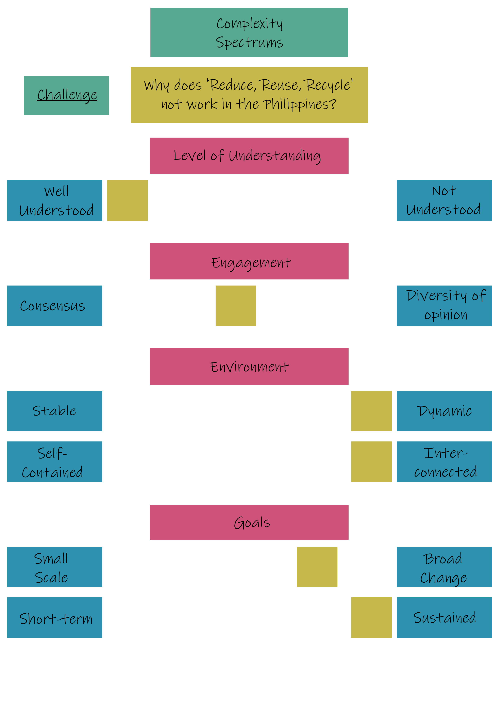

Systems Practice Challenge
--------------------------

**Why does ‘Reduce, Reuse, Recycle’ not work in the Philippines?**

### Outline

Why does waste management fail in the Philippines? Though there is a general consensus that large production of waste is detrimental to the environment and the issue is also globally well understood and sometimes even rather well-managed (see [US, San Francisco](https://www.cnbc.com/2018/07/13/how-san-francisco-became-a-global-leader-in-waste-management.html) or [Germany, Munich](https://zerowastecities.eu/the-story-of-munich/)) many Filipino communities don't have either the incentive or power to  solve or approach this problem.

We classify this issue as very dynamic and interconnected within the problem environment, as the problem requires a huge change in an individual's lifestyle and majorly affects the economy on a municipal (if not even broader) level, which makes the problem and the attempt to solve it using “linear methods” rather unpredictable.

The solution we intend to roll-out should be a long-term benefit, as opposed to a “quick-fix”, that would simply push the issue further down the timeline.

### Complexity Spectrums Chart

